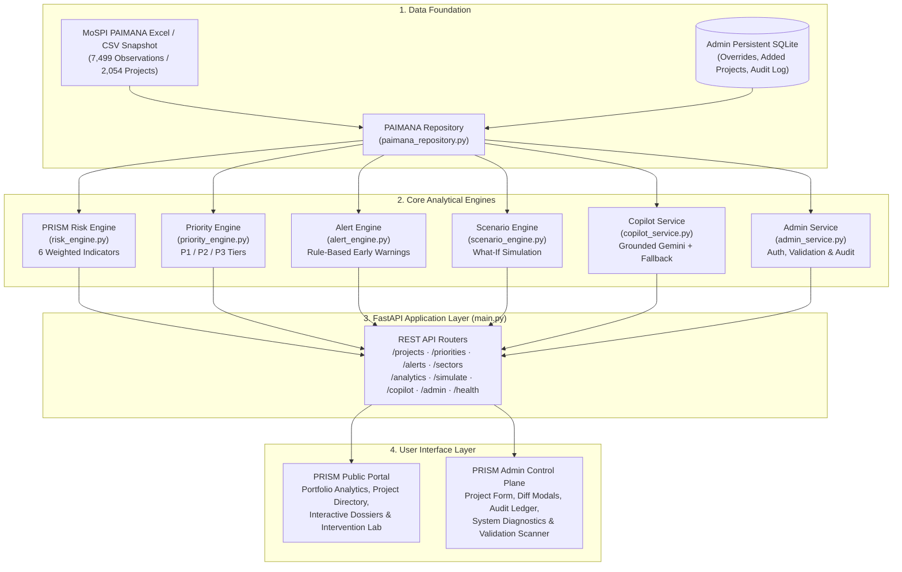
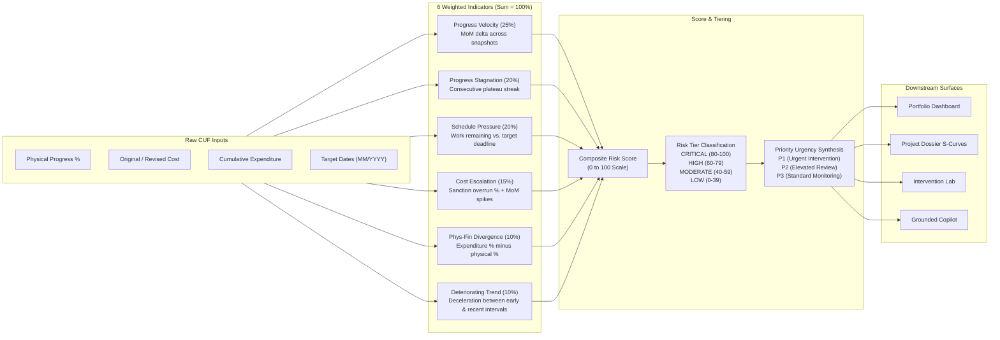

# PRISM — Predictive Risk Intelligence & Smart Monitoring

An integrated, explainable project-monitoring platform transforming longitudinal infrastructure monitoring data into deterministic risk indices, prioritized intervention queues, and counterfactual scenario simulations for central sector oversight.

---

## Badges

[](https://www.python.org/)
[](https://fastapi.tiangolo.com/)
[](#testing)
[](#cuf-field-attribution)
[-purple.svg)](#data-flow--risk-scoring-pipeline)
[](#problem-statement-context)

---

## Table of Contents

- [Problem Statement Context](#problem-statement-context)
- [System Architecture](#system-architecture)
- [Data Flow & Risk Scoring Pipeline](#data-flow--risk-scoring-pipeline)
- [Key Features](#key-features)
- [Common Upload Form (CUF) Field Attribution](#common-upload-form-cuf-field-attribution)
- [Tech Stack](#tech-stack)
- [Project Structure](#project-structure)
- [Getting Started & Setup](#getting-started--setup)
- [API Reference](#api-reference)
- [Testing](#testing)
- [Screenshots](#screenshots)

---

## Problem Statement Context

* **Problem Statement ID:** SIH26103
* **Target Ministry:** Ministry of Statistics and Programme Implementation (MoSPI), Government of India
* **Theme:** Development of a web-based integrated project-monitoring platform for Central Sector Infrastructure Projects costing ₹150 Crore and above.

### What "Web-Based Integrated Project-Monitoring Platform" Means

National infrastructure oversight currently relies on monthly flash reports submitted through the MoSPI Online Central Monitoring System (OCMS) / PAIMANA framework. While these reports compile milestone percentages and expenditure totals, raw monthly snapshots obscure critical operational trends:
1. **Stagnation masked by static progress:** Projects that make zero progress across multiple consecutive quarters remain indistinguishable from active projects when reviewing one monthly report at a time.
2. **Capital outflow without physical delivery:** Projects experiencing substantial financial disbursements without commensurate physical advancement escape early intervention.
3. **Imminent deadline compressions:** Distant target commissioning dates mask severe early-stage progress deceleration until deadlines become impossible to meet.

PRISM delivers a centralized digital cockpit designed for oversight authorities—including the Cabinet Secretariat, the Project Monitoring Group (PMG), and MoSPI's Infrastructure and Project Monitoring Division (IPMD). It unifies multi-month reporting snapshots into an auditable intelligence pipeline:

$$\text{PAIMANA / CUF Data} \longrightarrow \text{Deterministic Risk Index} \longrightarrow \text{Intervention Prioritization} \longrightarrow \text{Counterfactual Simulation} \longrightarrow \text{Executive Action}$$

### Specific SIH26103 Requirements Addressed

| SIH26103 Requirement | PRISM Implementation | Code Reference |
| :--- | :--- | :--- |
| **Comprehensive Central Sector Oversight** | Ingests and monitors all 2,054 central sector infrastructure projects across 7,499 multi-month snapshots (April–July 2026). | [`backend/repositories/paimana_repository.py`](file:///c:/PRISM/backend/repositories/paimana_repository.py) |
| **Objective Project Risk Assessment** | Deterministic multi-criteria decision analysis (MCDA) generating an explainable 0–100 composite risk score without black-box opacity. | [`backend/services/risk_engine.py`](file:///c:/PRISM/backend/services/risk_engine.py) |
| **Actionable Prioritization Queue** | Separates operational urgency from raw risk score to classify projects into distinct P1, P2, and P3 intervention tiers. | [`backend/services/priority_engine.py`](file:///c:/PRISM/backend/services/priority_engine.py) |
| **Common Upload Form (CUF) Attribution** | Formulates empirical prediction models and evaluates incremental predictive power of native CUF fields vs. engineered indicators. | [`ml/train_real_models.py`](file:///c:/PRISM/ml/train_real_models.py) & [CUF Section](#common-upload-form-cuf-field-attribution) |
| **Intervention Simulation ("What-If" Lab)** | Interactive counterfactual modeling assessing the quantitative impact of land clearance fast-tracking, contractor liquidity injections, and High-Powered Committees. | [`backend/services/scenario_engine.py`](file:///c:/PRISM/backend/services/scenario_engine.py) |
| **Grounded Conversational Intelligence** | Copilot assistant strictly constrained to verified repository facts, calculating zero scores dynamically to eliminate LLM hallucinations. | [`backend/services/copilot_service.py`](file:///c:/PRISM/backend/services/copilot_service.py) |
| **Administrative Control & Governance** | Role-based control plane allowing project updates, administrative additions, and soft archival backed by an immutable SQLite audit log. | [`backend/routes/admin.py`](file:///c:/PRISM/backend/routes/admin.py) & [`backend/services/admin_service.py`](file:///c:/PRISM/backend/services/admin_service.py) |

---

## System Architecture



---

## Data Flow & Risk Scoring Pipeline

PRISM's authoritative risk rating is 100% deterministic, auditable, and mathematical. It combines 6 orthogonal indicators across a project's longitudinal reporting history:



### Risk Indicator Breakdown

| Indicator ID | Label | Category | Weight | Description |
| :--- | :--- | :--- | :---: | :--- |
| `velocity` | **Progress Velocity** | Progress | **25%** | Average month-over-month physical advancement rate ($pp/\text{month}$). High deceleration or negative velocity incurs critical penalties. |
| `stagnation` | **Progress Stagnation** | Progress | **20%** | Detects consecutive reporting intervals with $\le 0.5\ pp$ progress change, penalizing protracted stall periods. |
| `schedule_pressure` | **Schedule Pressure** | Schedule | **20%** | Evaluates required delivery velocity against remaining months until revised completion target. Automatically flags expired targets. |
| `cost_escalation` | **Cost Escalation** | Cost | **15%** | Percentage escalation from original sanction budget to latest revised cost, with penalties for sharp month-over-month increases. |
| `phys_fin_divergence` | **Physical-Financial Divergence** | Execution | **10%** | Measures discrepancy between capital disbursement ($\%$ of revised cost) and certified physical delivery ($\%$). Disproportionate spend without physical progress signals high risk. |
| `deteriorating_trend` | **Deteriorating Trend** | Trend | **10%** | Compares earlier velocity against recent velocity to identify projects that are actively slowing down. |

---

## Key Features

* **Portfolio Risk Intelligence (`GET /api/projects`, `GET /api/analytics`)**:
  Real-time executive dashboard summarizing total capital outlay (₹ Cr), expenditure absorption, active project status, and risk tier stratification across 2,054 central infrastructure assets.
* **Deterministic Risk Scoring (`GET /api/projects/{id}/risk`)**:
  Auditable factor attribution displaying raw metric values, normalized scores, indicator weights, and weighted point contributions for any given project.
* **Prioritized Intervention Queue (`GET /api/priorities`)**:
  Synthesizes risk scores, schedule urgency, recent deterioration velocity, and capital exposure to route critical projects into actionable P1, P2, and P3 review tiers.
* **Proactive Early-Warning Alerts (`GET /api/alerts`)**:
  Automated rules engine scanning every project snapshot for stagnation plateaus, cost revisions, schedule slippages, and severe physical-financial divergence.
* **Longitudinal S-Curve Tracking (`GET /api/projects/{id}/history`)**:
  Traces certified physical progress and financial expenditure across consecutive monthly monitoring snapshots (April, May, June, July 2026).
* **Peer Sector Benchmarking (`GET /api/projects/{id}/benchmark`)**:
  Benchmarks individual project metrics against sector-wide medians for physical progress velocity, cost escalation, and delay profiles.
* **Counterfactual Intervention Lab (`POST /api/simulate`)**:
  Calculates what-if policy trajectories by modeling statutory land acquisition clearance acceleration (weeks), contractor liquidity advances ($\%$), weather mitigation measures, and High-Powered Committee (HPC) oversight.
* **Grounded AI Copilot (`POST /api/copilot/chat`)**:
  Natural language inquiry interface powered by Google Gemini (with rule-based fallback). The assistant is strictly grounded on deterministic engine calculations and verified project attributes.
* **Administrative Control Plane (`/admin`)**:
  Authenticated operations dashboard supporting administrative project creation, field modifications with before/after diff audit cards, soft archiving, and rollback of overrides to restore original PAIMANA baselines.
* **Automated Data Validation Scanner (`GET /api/admin/data-validation`)**:
  Integrity auditor scanning effective records for schema completeness, negative expenditure anomalies, progress bounds violations, and chronological inconsistencies.

---

## Common Upload Form (CUF) Field Attribution

Under MoSPI's Online Central Monitoring System (OCMS) / PAIMANA, executing agencies submit project updates via the **Common Upload Form (CUF)**. SIH Problem Statement 26103 explicitly requires evaluating:

> *"Development of prediction and analytical models based on the existing Common Upload Form (CUF) fields... along with an assessment of the extent to which predictive performance is attributable to the current CUF fields vis-à-vis additional variables not presently captured in the CUF."*

To satisfy this mandate rigorously, PRISM implements a group-stratified empirical ablation pipeline ([`ml/train_real_models.py`](file:///c:/PRISM/ml/train_real_models.py)) using verified dataset observations from [`data/PRISM_ML_features_v1.csv`](file:///c:/PRISM/data/PRISM_ML_features_v1.csv).

### 1. Feature Classification

| Feature Name | Native CUF Field? | Feature Category | Description / Derivation | Model Inclusion |
| :--- | :---: | :---: | :--- | :---: |
| `original_cost_cr` | **Yes** | Raw Input | Sanctioned / original project budget in ₹ Crore | Model A & B |
| `revised_cost_cr` | **Yes** | Raw Input | Anticipated / revised project budget in ₹ Crore | Model A & B |
| `cumulative_expenditure_cr` | **Yes** | Raw Input | Cumulative financial expenditure to date in ₹ Crore | Model A & B |
| `physical_progress_pct` | **Yes** | Raw Input | Cumulative certified physical completion percentage | Model A & B |
| `expenditure_pct_of_revised_cost` | **No** | Derived Indicator | $\frac{\text{cumulative\_expenditure\_cr}}{\text{revised\_cost\_cr}} \times 100$ | Model B Only |
| `progress_expenditure_gap` | **No** | Derived Indicator | $\text{expenditure\_pct\_of\_revised\_cost} - \text{physical\_progress\_pct}$ | Model B Only |
| `cost_revision_pct` | **No** | Derived Indicator | $\frac{\text{revised\_cost\_cr} - \text{original\_cost\_cr}}{\text{original\_cost\_cr}} \times 100$ | Model B Only |
| `derived_sector` | **No** | Domain Variable | One-hot encoded infrastructure sector classification | Model B Only |

### 2. Empirical Ablation Results

Both models predict project delay in months (`time_overrun_months`), trained using a `GradientBoostingRegressor` evaluated under an 80/20 `GroupShuffleSplit` partitioned by `project_id` (1,497 held-out test observations) to eliminate temporal data leakage across monthly snapshots:

| Metric | Model A (Native CUF Only) | Model B (CUF + Engineered Variables) | Incremental Improvement ($\Delta$) | Relative Gain |
| :--- | :---: | :---: | :---: | :---: |
| **Mean Absolute Error (MAE)** | 16.52 months | **15.46 months** | **-1.05 months** | **6.4% reduction** |
| **Root Mean Squared Error (RMSE)** | 25.46 months | **24.89 months** | **-0.57 months** | **2.2% reduction** |
| **Explained Variance ($R^2$)** | 0.245 | **0.279** | **+0.033** | **13.5% gain** |

*(Verified from [`ml/artifacts/real_model_metadata.json`](file:///c:/PRISM/ml/artifacts/real_model_metadata.json))*

### 3. Key Findings & Causal Attribution Disclaimer

* **Finding:** While native CUF fields capture basic project magnitude, deriving relational indicators (such as the gap between financial expenditure and physical progress, plus cost escalation percentage) improves delay prediction accuracy by over 1 month of MAE.
* **Feature Importance:** Feature importance analysis reveals that physical progress percentage ($31.99\%$) and cost revision percentage ($19.04\%$) account for over half of total predictive importance.
* **Causal Disclaimer:** This ablation reflects the incremental associative contribution of engineered variables under this evaluation methodology. It does not imply that engineered features directly cause project delays, but demonstrates that synthesizing financial absorption ratios and execution divergence captures failure dynamics that raw tabular totals alone cannot reflect.

---

## Tech Stack

| Architectural Layer | Technology | Version / Specification | Justification |
| :--- | :--- | :--- | :--- |
| **Backend Runtime** | Python | 3.10+ (Tested on 3.14) | Standard data science & asynchronous backend environment |
| **Web Framework** | FastAPI | `>=0.115.0` | High-throughput asynchronous REST routing with native OpenAPI docs |
| **ASGI Web Server** | Uvicorn | `>=0.30.0` | Production-grade ASGI server with asynchronous connection handling |
| **Validation & Schemas** | Pydantic | `>=2.8.0` | Strict data serialization, request validation, and schema generation |
| **Data Processing** | Pandas & OpenPyXL | `>=2.2.0` / `>=3.1.5` | In-memory indexing and parsing of official MoSPI PAIMANA Excel/CSV datasets |
| **Machine Learning** | Scikit-learn | `>=1.5.0` | Gradient Boosting regression and GroupShuffleSplit validation for CUF ablation |
| **Conversational AI** | Google GenAI SDK | `google-genai >=2.0.0` | Official client library for grounded Gemini LLM assistance |
| **Audit Persistence** | SQLite3 | Native Standard Library | Lightweight, zero-config relational store with WAL mode for admin audit trails |
| **Frontend Framework** | Vanilla JavaScript | ES6 Modules (`type="module"`) | Dependency-free, lightning-fast execution without bloated node build chains |
| **Frontend Styling** | Vanilla CSS + Tailwind | Utility Layer via CDN | Responsive executive layout, dark mode elements, and mobile-ready viewports |
| **Icons** | Lucide Icons | CDN Distribution | Clean, accessible iconography across portal and admin interfaces |
| **Automated Testing** | Pytest & HTTPX | `>=8.0.0` / `>=0.27.0` | Comprehensive integration, contract, parity, and redteam testing |

---

## Project Structure

```text
PRISM/
├── backend/                        # FastAPI Backend Application
│   ├── config.py                   # Centralized configuration & environment variables
│   ├── main.py                     # ASGI application entrypoint & static mounts
│   ├── requirements.txt            # Backend Python dependencies
│   ├── models/                     # Pydantic v2 domain schemas
│   │   ├── common.py               # Enums (RiskTier, PriorityTier) & base models
│   │   ├── project.py              # Project & PaimanaObservation models
│   │   ├── risk.py                 # RiskAssessment, RiskIndicator & Priority models
│   │   └── simulation.py           # What-If simulation request/response schemas
│   ├── repositories/               # Data access & persistence abstractions
│   │   ├── paimana_repository.py   # Primary repository indexing 2,054 projects
│   │   └── demo_data.py            # Synthesized fallback dataset for sandbox mode
│   ├── routes/                     # Modular API endpoints
│   │   ├── admin.py                # Admin auth, project CRUD, diff audit, validation
│   │   ├── alerts.py               # Early warning anomaly alerts
│   │   ├── analytics.py            # Aggregate portfolio KPI endpoints
│   │   ├── copilot.py              # Conversational grounded Copilot endpoint
│   │   ├── demo.py                 # Toggle between PAIMANA and demo data sources
│   │   ├── health.py               # Operational liveness & health inspection
│   │   ├── metadata.py             # Distinct sector and state lists for UI filters
│   │   ├── priorities.py           # Multi-criteria prioritization queue
│   │   ├── projects.py             # Project search, pagination, S-curves & benchmarks
│   │   ├── sectors.py              # Sector-level aggregation & risk distribution
│   │   └── simulation.py           # Counterfactual intervention lab simulation
│   ├── services/                   # Authoritative business logic engines
│   │   ├── admin_service.py        # SQLite admin persistence, sessions & audit logging
│   │   ├── alert_engine.py         # Anomaly detection & warning rules
│   │   ├── copilot_service.py      # LLM query interpretation with fact grounding
│   │   ├── priority_engine.py      # Urgency synthesis & P1/P2/P3 classification
│   │   ├── project_query_service.py# Multi-facet filtering & sorting
│   │   ├── rate_limiter.py         # Request rate limiter for public endpoints
│   │   ├── risk_engine.py          # Deterministic 6-indicator MCDA risk engine
│   │   ├── scenario_engine.py      # Sensitivity simulation & trajectory forecasting
│   │   └── state_manager.py        # Global application state holder
│   └── tests/                      # Automated test suite (124 passing tests)
│       ├── test_admin_suite.py     # Admin auth, CRUD, 404s, override rollback
│       ├── test_adversarial_redteam.py # Prompt injection & search edge cases
│       ├── test_api_endpoints.py   # HTTP contract verification
│       ├── test_benchmarking_and_hardening.py # Rate limiting & peer benchmarking
│       ├── test_canonical_matrix.py# Comprehensive KPI invariance & parity tests
│       ├── test_copilot_regression.py # Copilot query routing & entity isolation
│       ├── test_cuf_ablation.py    # SIH26103 CUF ablation schema & metrics
│       ├── test_integration_fixes.py # Frontend-backend contract regression tests
│       ├── test_paimana_counts.py  # 2,054 project count & observation invariants
│       ├── test_priority_parity.py # Deterministic priority tier logic
│       └── test_risk_parity.py     # Deterministic risk engine calculation tests
├── data/                           # Canonical Datasets
│   ├── PRISM_PAIMANA_Dataset_v1_Apr-Jul_2026.xlsx # Official 4-month PAIMANA dataset
│   ├── PRISM_ML_features_v1.csv    # Extracted feature matrix for empirical ML
│   └── prism_admin.db              # SQLite persistence database (auto-created)
├── docs/                           # Architectural & Developer Documentation
│   ├── ARCHITECTURE.md             # In-depth system architecture design document
│   ├── PYTHON_BACKEND_GUIDE.md     # Backend service implementation details
│   ├── QUICKSTART.md               # Rapid deployment guide
│   └── WHERE_TO_EDIT.md            # Maintenance map for codebase navigation
├── frontend/                       # Public & Administrative Web Interfaces
│   ├── index.html                  # Main PRISM Portal Single-Page Application
│   ├── admin/                      # Admin Control Plane HTML templates
│   │   ├── admin.css               # Shared administrative styles
│   │   ├── admin.js                # Shared admin API client & UI components
│   │   ├── audit.html              # Tamper-evident administrative audit log
│   │   ├── index.html              # Admin control plane dashboard
│   │   ├── login.html              # Accessible administrative login interface
│   │   ├── project-form.html       # Project registration & diff confirmation modal
│   │   ├── projects.html           # Administrative project inventory management
│   │   ├── system.html             # System diagnostics & telemetry status
│   │   └── validation.html         # Data integrity & anomaly scanner
│   ├── assets/                     # Third-party vendor assets (Lucide icons)
│   ├── css/                        # Public portal style definitions
│   │   ├── components.css          # Badges, cards, sliders, and modal components
│   │   └── styles.css              # Core typography, color system & layout
│   └── js/                         # Modular public frontend logic
│       ├── alerts.js               # Early-warning notification list rendering
│       ├── analytics.js            # Portfolio KPI cards & distribution charts
│       ├── api.js                  # Centralized REST API client
│       ├── app.js                  # SPA routing & hash-based view controller
│       ├── copilot.js              # Grounded Copilot chat window controller
│       ├── dashboard.js            # Summary KPI rendering
│       ├── map.js                  # Geographic distribution placeholder
│       ├── project-detail.js       # S-curve charting & project dossier modal
│       ├── projects.js             # Project directory with facet filtering
│       ├── reports.js              # Executive summary flash report generation
│       ├── scenario.js             # Intervention Lab slider & simulation handler
│       ├── state.js                # Client-side state container
│       └── utils.js                # Currency formatting & HTML sanitization
├── ml/                             # Machine Learning & SIH26103 CUF Ablation
│   ├── README.md                   # Detailed CUF ablation experimental report
│   ├── train_real_models.py        # Reproducible empirical training script
│   └── artifacts/                  # Trained model outputs & benchmark metadata
│       └── real_model_metadata.json# Serialized evaluation metrics & feature weights
├── Dockerfile                      # Container build definition
├── docker-compose.yml              # Multi-container orchestration specification
├── launch.bat                      # One-click Windows desktop launcher
└── package.json                    # Workspace metadata & script shortcuts
```

---

## Getting Started & Setup

### Prerequisites

* **Python:** 3.10, 3.11, 3.12, 3.13, or 3.14 installed and added to `PATH`.
* **Git:** Installed on system.

### Option A: One-Click Windows Launch (Recommended for Windows)

Simply double-click [`launch.bat`](file:///c:/PRISM/launch.bat) in the repository root. The launcher will:
1. Detect your Python environment automatically (virtual environments, `py` launcher, or system Python).
2. Resolve the configured port from `.env` (default: `8000`).
3. Start the FastAPI backend server in a dedicated window.
4. Actively poll `/api/health` until the dataset is initialized.
5. Automatically open both the **PRISM Portal** (`http://127.0.0.1:8000/`) and **Admin Panel** (`http://127.0.0.1:8000/admin/login`) in your default browser.

### Option B: Manual Cross-Platform Setup

1. **Clone the Repository:**
   ```bash
   git clone https://github.com/abhinavg138/PRISM.git
   cd PRISM
   ```

2. **Create and Activate a Virtual Environment:**
   ```bash
   # On Windows:
   python -m venv .venv
   .venv\Scripts\activate

   # On Linux / macOS:
   python3 -m venv .venv
   source .venv/bin/activate
   ```

3. **Install Dependencies:**
   ```bash
   pip install -r backend/requirements.txt
   ```

4. **Configure Environment Variables (Optional):**
   Copy the template environment file:
   ```bash
   cp .env.example .env
   ```
   * *Gemini AI Copilot (Optional):* Add your `GEMINI_API_KEY` to `.env` to enable full Gemini LLM synthesis. If omitted, PRISM operates in deterministic fallback mode with zero runtime errors.
   * *Production Configuration:* Set `ENVIRONMENT=production`, and define `PRISM_ADMIN_USERNAME`, `PRISM_ADMIN_PASSWORD`, and `PRISM_ADMIN_SECRET`. In development mode, safe local defaults (`admin` / `prismadmin2026`) are enabled automatically.

5. **Start the PRISM Application:**
   ```bash
   python -m uvicorn backend.main:app --host 127.0.0.1 --port 8000 --reload
   ```

6. **Access the Application:**
   * **PRISM Main Portal:** [http://127.0.0.1:8000/](http://127.0.0.1:8000/)
   * **Administrative Control Plane:** [http://127.0.0.1:8000/admin/login](http://127.0.0.1:8000/admin/login)
   * **Interactive OpenAPI Documentation:** [http://127.0.0.1:8000/docs](http://127.0.0.1:8000/docs)

---

## API Reference

All routes are served directly by FastAPI and documented interactively at `/docs`.

### Public & Monitoring APIs

| Method | Endpoint | Description |
| :--- | :--- | :--- |
| `GET` | `/api/health` | Service health status, monitored project count, and dataset snapshot metadata |
| `GET` | `/api/metadata` | Distinct lists of sectors and administrative states for frontend dropdown filters |
| `GET` | `/api/projects` | Filter, search, and paginate projects with aggregate portfolio KPIs |
| `GET` | `/api/projects/{id}` | Detailed attributes for a single project |
| `GET` | `/api/projects/{id}/history` | Longitudinal monthly observations and S-curve progression (Apr–Jul 2026) |
| `GET` | `/api/projects/{id}/observations` | Alias endpoint for full chronological observation records |
| `GET` | `/api/projects/{id}/risk` | Transparent risk breakdown: composite score, tier, and 6 indicator contributions |
| `GET` | `/api/projects/{id}/priority` | Priority assessment, urgency score, and recommended intervention action |
| `GET` | `/api/projects/{id}/benchmark` | Comparison of project progress velocity and cost overrun against sector peers |
| `GET` | `/api/projects/{id}/alert` | Active early-warning flags for a specific project |
| `GET` | `/api/priorities` | High-priority intervention queue categorized by P1, P2, and P3 tiers |
| `GET` | `/api/alerts` | Filterable early-warning anomalies (stagnation, cost overrun, schedule delay) |
| `GET` | `/api/sectors` | Sector-level capital outlays, project counts, and average risk indices |
| `GET` | `/api/analytics` | High-level portfolio aggregates, completion rates, and delay distributions |
| `POST`| `/api/simulate` | Execute what-if simulation (land clearance, liquidity, HPC intervention) |
| `POST`| `/api/copilot/chat` | Natural language inquiry assistant grounded on verified project data |
| `POST`| `/api/demo/toggle` | Switch runtime state between PAIMANA dataset and synthesized demo sandbox |

### Administrative Control Plane APIs

| Method | Endpoint | Description |
| :--- | :--- | :--- |
| `POST` | `/api/admin/auth/login` | Authenticate administrative user and establish secure session |
| `POST` | `/api/admin/auth/logout` | Invalidate administrative session and clear session cookie |
| `GET` | `/api/admin/auth/me` | Inspect current administrative session credentials and role |
| `GET` | `/api/admin/overview` | Control plane operational summary and modification metrics |
| `GET` | `/api/admin/projects` | Administrative project listing including archived and modified records |
| `GET` | `/api/admin/projects/{id}` | Administrative project inspection with full override and audit history |
| `POST` | `/api/admin/projects` | Register a new capital project into PRISM with automatic risk indexing |
| `PUT` | `/api/admin/projects/{id}` | Apply field overrides, record audit reason, and recalculate risk score |
| `POST` | `/api/admin/projects/{id}/archive` | Soft-archive a project to exclude it from standard public monitoring |
| `POST` | `/api/admin/projects/{id}/unarchive` | Restore an archived project back to active monitoring |
| `DELETE`| `/api/admin/projects/{id}/overrides` | Remove all administrative overrides and restore pristine PAIMANA values |
| `DELETE`| `/api/admin/projects/{id}/overrides/{field}` | Remove a single field override and restore original PAIMANA value |
| `GET` | `/api/admin/audit-log` | Chronological, immutable administrative audit log with before/after diffs |
| `GET` | `/api/admin/data-validation` | Automated dataset scanner auditing records for schema and plausibility issues |
| `GET` | `/api/admin/system` | System diagnostic metrics, database storage size, and environment status |

---

## Testing

PRISM enforces rigorous test coverage across deterministic scoring invariants, API contracts, adversarial prompt hardening, and data fidelity.

### Running the Test Suite

Execute the complete automated test suite:

```bash
pytest backend/tests/ -v
```

To run targeted test suites:

```bash
# Verify the deterministic risk engine scoring parity:
pytest backend/tests/test_risk_parity.py -v

# Verify the priority engine classification logic:
pytest backend/tests/test_priority_parity.py -v

# Verify SIH26103 CUF ablation schemas and metrics:
pytest backend/tests/test_cuf_ablation.py -v

# Verify isolated admin control plane, authentication, and override rollback:
pytest backend/tests/test_admin_suite.py -v

# Verify adversarial copilot prompt injection & search boundary attacks:
pytest backend/tests/test_adversarial_redteam.py -v
```

### Current Test Verification Status

```text
============================= test session starts =============================
platform win32 -- Python 3.14.6, pytest-9.1.1, pluggy-1.6.0
rootdir: C:\PRISM
collected 124 items

backend/tests/test_admin_suite.py ............                           [  9%]
backend/tests/test_adversarial_redteam.py ...........................    [ 31%]
backend/tests/test_api_endpoints.py .................                    [ 45%]
backend/tests/test_benchmarking_and_hardening.py .....                   [ 49%]
backend/tests/test_canonical_matrix.py ..............                    [ 60%]
backend/tests/test_copilot_regression.py ..................              [ 75%]
backend/tests/test_cuf_ablation.py ...                                   [ 77%]
backend/tests/test_integration_fixes.py .................                [ 91%]
backend/tests/test_paimana_counts.py ...                                 [ 93%]
backend/tests/test_priority_parity.py .....                              [ 97%]
backend/tests/test_risk_parity.py ...                                    [100%]

====================== 124 passed, 2 warnings in 58.09s =======================
```

* **Total Test Cases:** **124**
* **Passing:** **124 (100%)**
* **Failures:** **0**

---

## Screenshots

> **Note:** Visual assets and UI walkthrough media will be captured and placed in `docs/assets/` during final presentation packaging. To preview the full UI live, start the server and navigate to [http://127.0.0.1:8000/](http://127.0.0.1:8000/).
