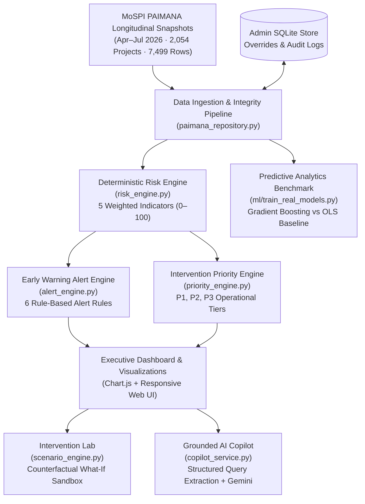
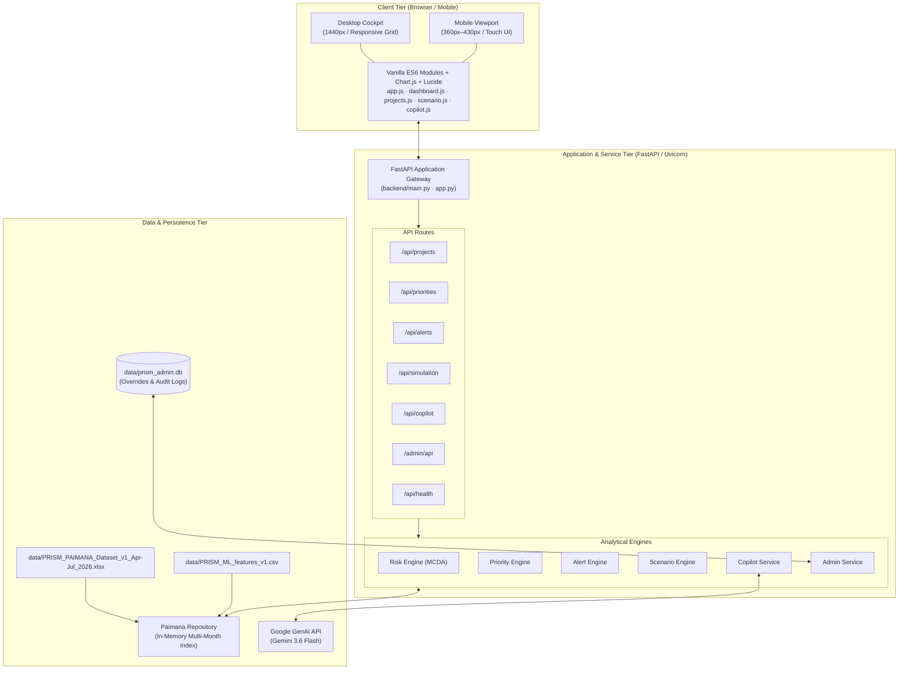

# PRISM — Predictive Risk Intelligence & Smart Monitoring

[](https://www.python.org/)
[](https://fastapi.tiangolo.com/)
[](#testing)
[](#data)
[-8B5CF6.svg?style=flat)](#risk-engine)
[](https://prism-kappa-wine.vercel.app/)
[](#smart-india-hackathon-2026)

An integrated project-monitoring platform that transforms longitudinal infrastructure monitoring data into risk intelligence, predictive analytics, early warnings, prioritization, and decision support for central sector project oversight.

---

## Smart India Hackathon 2026

* **Problem Statement ID:** SIH26103
* **Problem Title:** Use case on web-based integrated project-monitoring platform
* **Theme:** Smart Automation
* **Category:** Software
* **Target Domain:** Central Sector Infrastructure Projects costing ₹150 Crore and above (MoSPI OCMS / PAIMANA framework)
* **Team:** RiskIQ

> [!NOTE]
> **Prototype Declaration:** PRISM is an independent working software prototype developed for Smart India Hackathon (SIH26103). It demonstrates how central sector monitoring data can be converted into objective, auditable risk intelligence. It is not currently deployed, endorsed, or officially operated by the Ministry of Statistics and Programme Implementation (MoSPI) or the Government of India.

---

## 🚀 Live Demo

The production prototype is deployed on Vercel Serverless Functions:

* **Live Prototype (Landing):** [https://prism-kappa-wine.vercel.app/](https://prism-kappa-wine.vercel.app/)
* **Platform Orientation:** [https://prism-kappa-wine.vercel.app/home](https://prism-kappa-wine.vercel.app/home)
* **Executive Dashboard:** [https://prism-kappa-wine.vercel.app/dashboard](https://prism-kappa-wine.vercel.app/dashboard)
* **API Health Check:** [https://prism-kappa-wine.vercel.app/api/health](https://prism-kappa-wine.vercel.app/api/health)
* **Interactive API Docs (Swagger UI):** [https://prism-kappa-wine.vercel.app/docs](https://prism-kappa-wine.vercel.app/docs)

---

## 🎥 Demo Video

<!-- YOUTUBE DEMO VIDEO — TO BE ADDED -->
🎬 **Demo video coming soon.**

> *To add the final video: replace `YOUR_VIDEO_ID` with the YouTube video ID after publication.*

---

## Problem Statement

Central Sector Infrastructure Projects (costing ₹150 Crore and above) form the foundation of national economic development across railways, road transport, energy, urban transit, and petroleum. In India, these projects are tracked via monthly flash reporting submitted through monitoring systems such as PAIMANA / OCMS under the Ministry of Statistics and Programme Implementation (MoSPI).

Monitoring thousands of high-capital projects across diverse implementing agencies presents significant operational challenges:

1. **Information Overload Across Longitudinal Reports:** Portfolios spanning over 2,000 active projects generate vast volumes of monthly milestone and expenditure data. Reviewing monthly tabular reports sequentially obscures multi-month trends.
2. **Progress Stagnation Hidden by Static Percentages:** A project reporting 45% completion month after month looks identical to an active project on a single-month sheet unless longitudinal change rates (velocity) are computed across successive reporting intervals.
3. **Physical-Financial Divergence:** Substantial cumulative capital expenditure can occur without commensurate physical progress on the ground, creating hidden fiscal exposure before formal milestone slippage is flagged.
4. **Prioritization Deficit:** Project monitoring authorities have finite operational capacity. Raw risk metrics indicate how severely a project is performing, but they do not account for time urgency, reporting confidence, or actionability when deciding which projects require immediate administrative escalation.

---

## PRISM Solution

PRISM is a web-based decision-support and risk-intelligence platform that bridges the gap between raw longitudinal data collection and proactive executive oversight.

```
PAIMANA / Project Monitoring Data
               ↓
    Ingestion & Validation
               ↓
Deterministic Risk Index + Predictive Analytics
               ↓
      Early Warning Signals
               ↓
          Priority Queue
               ↓
  Benchmarking / Scenario Analysis
               ↓
        Decision Dashboard
               ↓
       Grounded AI Copilot
```

### Core Operating Paradigm: Prediction → Explanation → Prioritization → Action

* **Prediction:** Leverages empirical machine learning benchmarks to forecast expected time-overrun trends from historical monitoring patterns.
* **Explanation:** Breaks composite scores down into five granular, auditable operational indicators so project officers understand precisely *why* a project is classified at risk.
* **Prioritization:** Combines risk severity with remaining schedule urgency, recent physical deterioration, and reporting observation confidence to rank projects into actionable operational tiers (P1, P2, P3).
* **Action:** Connects diagnostic insights directly to prescriptive recommended actions, counterfactual scenario simulations in the Intervention Lab, and natural-language query resolution via the grounded AI Copilot.

---

## Key Features

* **Deterministic Risk Intelligence:** Computes an objective 0–100 composite risk score from multi-month snapshot data across 5 distinct indicators with full mathematical auditability.
* **Intervention Priority Queue:** Separates operational urgency from raw risk, ensuring oversight teams focus immediately on high-impact projects nearing critical milestones.
* **Early Warning Radar:** Continuously evaluates project trajectories against 6 empirical alert rules (stagnation, cost revision, schedule pressure, expenditure divergence, deceleration, critical thresholds).
* **Predictive Analytics Benchmark:** Empirically validated ablation study assessing the predictive contribution of native Common Upload Form (CUF) fields versus engineered longitudinal indicators for time-overrun forecasting.
* **Comparative Sector Benchmarking:** Automatically benchmarks each project's progress rate, cost escalation, and risk index against peers within the same infrastructure sector.
* **Intervention Lab ("What-If" Simulation):** Interactive policy sandbox simulating the quantitative impact of land clearance acceleration, contractor liquidity injections, geotechnical mitigation, and High-Powered Committee (HPC) fast-tracking.
* **Grounded AI Copilot:** Natural-language conversational interface powered by Google Gemini, backed by strict structured query filtering in Python to prevent LLM hallucinations or synthetic record fabrication.
* **Administrative Governance Plane:** Role-based administrative interface providing dataset reload capabilities, manual data override management, and an immutable SQLite audit log tracking every user modification.
* **Responsive Mobile Experience:** Mobile-first responsive UI featuring sticky bottom navigation, touch-optimized card interactions (>= 44px targets), safe-area compliance, and full desktop parity.

---

## How PRISM Works

PRISM maintains a strict distinction between **deterministic operational risk intelligence** (which governs official rankings, alerts, and dashboard decisions) and **predictive/statistical ML analytics** (which provides empirical benchmarks for timeline forecasting).



---

## Risk Engine

The PRISM Risk Engine is a 100% deterministic, auditable multi-criteria decision analysis (MCDA) framework. It evaluates multi-month observations to produce a composite risk index from 0 to 100.

> [!IMPORTANT]
> **Auditable Index vs. Calibrated Probability:** The 0–100 composite risk score is an objective, observable project-health index derived from observable warning signals. It represents the degree of operational stress evident in reporting data. It is **not** a calibrated percentage probability of project failure. Weights are expert-designed prototype heuristics designed for demonstrative oversight.

### Indicator Breakdown & Weights

| Indicator | Weight | Category | Operational Definition |
| :--- | :---: | :--- | :--- |
| **Progress Velocity** | **25%** | Progress | Average month-over-month rate of physical advancement compared against expected delivery pace. |
| **Progress Stagnation** | **20%** | Progress | Detection of consecutive reporting periods showing $\le 0.5$ percentage points of physical advancement. |
| **Schedule Pressure** | **20%** | Schedule | Ratio of remaining physical work to remaining time until revised target completion date. |
| **Cost Escalation** | **20%** | Cost | Percentage increase of revised project outlay over original approved outlay, plus recent revision penalties. |
| **Physical-Financial Divergence** | **15%** | Execution | Quantitative gap between cumulative fund utilization percentage and verified physical progress percentage. |
| **Total** | **100%** | — | — |

### Risk Tiers

$$\text{Composite Score} = \sum_{i=1}^{5} \left( \text{Normalized Indicator Score}_i \times \frac{\text{Weight}_i}{100} \right)$$

* **Critical Risk (80–100):** Severe, compounded execution failure requiring immediate Cabinet-level or ministerial escalation.
* **High Risk (60–79):** Significant schedule or cost distress requiring active inter-agency mitigation.
* **Moderate Risk (40–59):** Developing execution friction or minor budget variance requiring focused divisional monitoring.
* **Low Risk (0–39):** Normal execution variance within acceptable parameters.

---

## Priority Engine

A project with a high risk score might be distant from its target commissioning date, whereas a moderately risky project may face a critical milestone next month. The PRISM Priority Engine decouples risk severity from operational intervention urgency:

* **Risk asks:** *"How concerning does this project currently look based on its performance history?"*
* **Priority asks:** *"Given limited oversight capacity and monitoring resources, which projects should receive attention first?"*

### Priority Formula & Weights

$$\text{Priority Score} = \left( \text{Risk Score} \times 0.40 \right) + \left( \text{Schedule Urgency} \times 0.25 \right) + \left( \text{Recent Deterioration} \times 0.20 \right) + \left( \text{Evidence Confidence} \times 0.15 \right)$$

| Factor | Weight | Evaluation Criteria |
| :--- | :---: | :--- |
| **Composite Risk Score** | **40%** | Baseline project health score from the Risk Engine (0–100). |
| **Schedule Urgency** | **25%** | Non-linear urgency scaling based on fractional years remaining until target commissioning date. |
| **Recent Deterioration** | **20%** | Rate of physical progress deceleration over the latest two consecutive observation cycles. |
| **Evidence Confidence** | **15%** | Reliability multiplier based on snapshot depth (4 months = 100%, 3 months = 75%, 2 months = 50%, 1 month = 25%). |

### Operational Intervention Tiers

* **P1 Tier (Score 70–100):** Immediate executive escalation, on-site task force deployment, or contractor mobilization review.
* **P2 Tier (Score 50–69):** Active divisional oversight, milestone-linked fund clearance audits, and recovery scheduling.
* **P3 Tier (Score 0–49):** Routine automated monitoring within regular monthly reporting cycles.

---

## Early Warning System

The Early Warning System translates observed longitudinal deviations into deterministic, categorized alert cards across six distinct rule sets.

> [!NOTE]
> **Rule-Based Alerts vs. AI Predictions:** Early Warning alerts are generated via deterministic, empirical rule thresholds applied directly to longitudinal observation histories. They are structured rule-based alerts, not black-box AI model outputs.

### Alert Classification Rules

1. **Progress Stagnation:** Physical completion change $\le 0.2$ percentage points across $\ge 2$ consecutive cycles.
2. **High/Critical Risk Threshold:** Composite PRISM Risk Index $\ge 80/100$ confirmed by longitudinal flash reports.
3. **Physical-Financial Divergence:** Cumulative budget utilization exceeds physical completion by $\ge 20.0$ percentage points with $\ge ₹10\text{ Cr}$ expenditure.
4. **Cost Escalation:** Sanctioned cost exceeds original approved outlay by $\ge 40.0\%$ with original outlay $\ge ₹10\text{ Cr}$.
5. **Schedule Pressure:** Schedule urgency $\ge 85$ with remaining physical scope $> 10\%$.
6. **Deteriorating Progress:** Significant deceleration where recent progress rate drops $\ge 1.5$ percentage points below historical multi-month average.

---

## Predictive Analytics / ML Benchmark

To address the **SIH26103 Technical Dimension (b)** requirement (*"Assessment of AI/ML techniques vs conventional statistical methods"*), PRISM includes an empirical benchmarking suite evaluating timeline overrun prediction using native Common Upload Form (CUF) fields versus engineered longitudinal features.

### Empirical Evaluation Setup

* **Target Variable:** `time_overrun_months` (difference between revised target completion and original target completion date).
* **Dataset Scope:** 7,499 longitudinal observations across 2,054 unique central sector projects (April–July 2026).
* **Validation Strategy:** `GroupShuffleSplit` (80% train / 20% test, grouped strictly by `project_id`) across 1,497 held-out test observations. Grouped splitting guarantees that observations from the same project do not appear in both training and testing folds, preventing temporal data leakage.
* **Baseline Algorithm:** Ordinary Least Squares (OLS) Linear Regression on native CUF fields.
* **ML Algorithm:** Gradient Boosting Regressor (`n_estimators=100`, `max_depth=4`, `learning_rate=0.08`, `random_state=42`).

### Verified Benchmark Results

| Model Architecture | Input Features | MAE (Months) ↓ | RMSE (Months) ↓ | $R^2$ Score ↑ | Relative MAE Gain |
| :--- | :--- | :---: | :---: | :---: | :---: |
| **Conventional Baseline (OLS)** | Native CUF (4 fields) | **16.82** | **26.41** | **0.188** | Baseline |
| **Gradient Boosting (Model A)** | Native CUF (4 fields) | **16.52** | **25.46** | **0.245** | +1.8% vs OLS |
| **Gradient Boosting (Model B)** | Native CUF + Engineered Features | **15.46** | **24.89** | **0.279** | **+8.0% vs OLS** |

### Metrics Definition
* **MAE (Mean Absolute Error):** The average magnitude of absolute timeline prediction errors, measured in months.
* **RMSE (Root Mean Squared Error):** Error metric penalizing larger prediction errors more heavily, reflecting variance stability.
* **$R^2$ (Coefficient of Determination):** Proportion of variance in time overrun explained by the model features.

### Feature Importance Attribution (Model B)
1. Physical Progress Percentage (`physical_progress_pct`): **31.99%**
2. Cost Revision Percentage (`cost_revision_pct`): **19.04%**
3. Original Cost Outlay (`original_cost_cr`): **13.82%**
4. Expenditure % of Revised Cost (`expenditure_pct_of_revised_cost`): **10.25%**
5. Progress-Expenditure Gap (`progress_expenditure_gap`): **8.10%**
6. Revised Cost Outlay (`revised_cost_cr`): **7.28%**
7. Cumulative Expenditure (`cumulative_expenditure_cr`): **4.90%**
8. Sector Encoding (Railways): **1.88%**

> [!NOTE]
> **Operational Boundary:** This predictive experiment serves as an empirical research and validation benchmark for SIH26103. The deterministic MCDA Risk Engine remains the authoritative operational ranking and decision layer within PRISM. PRISM does not claim production-grade automated forecasting or causal timeline prediction.

---

## AI Copilot

The PRISM AI Copilot provides an interactive natural-language interface for executive query resolution, powered by Google Gemini (`gemini-3.6-flash`).

```
User Query: "Which projects in Maharashtra have critical risk and cost escalation above 50%?"
                                ↓
               Deterministic Entity & Intent Parser
      (Extracts State='Maharashtra', RiskTier='CRITICAL', CostOverrun>50)
                                ↓
               Structured Python Repository Filtering
             (Retrieves verified project subset from memory)
                                ↓
                 Grounded Context Construction
        (Injects ONLY real PAIMANA records into the prompt)
                                ↓
            Gemini GenAI Synthesis & Recommendation
```

### Hallucination Prevention & Factual Grounding
* **Structured Query Translation:** User queries are parsed by deterministic regex and string matching routines (`ProjectQueryService`) to identify states, sectors, risk tiers, cost thresholds, and project IDs before invoking the LLM.
* **Zero Synthetic Records:** Factual project tables and counts are queried directly from the verified in-memory repository. The LLM is provided with pre-filtered, verified records as context, preventing it from inventing non-existent projects or hallucinating project metrics.
* **Deterministic Fallback:** If the Gemini API key is not configured or network connectivity is unavailable, the Copilot automatically falls back to an internal rule-based heuristic synthesizer that provides comprehensive analytical responses without external API calls.

---

## Intervention Lab

The Intervention Lab is an interactive counterfactual scenario sandbox designed to test the sensitivity of project risk to simulated policy interventions.

### Supported Policy Levers
1. **Land Clearance Fast-Tracking:** Accelerates statutory and right-of-way clearances by 0–52 weeks.
2. **Contractor Liquidity Injection:** Simulates working capital mobilization relief from 0% to 100%.
3. **Geological & Weather Mitigation:** Evaluates engineering risk reduction from 0% to 100%.
4. **High-Powered Committee (HPC) Escalation:** Simulates inter-ministerial single-window dispute resolution.

> [!WARNING]
> **Simulation Disclaimer:** The Intervention Lab is an illustrative policy simulation sandbox. Simulated outcomes represent mathematical adjustments to risk indicators within the sandbox context. They are what-if analytical tools and do **not** alter authoritative PAIMANA records or guarantee real-world completion dates.

---

## Data

PRISM is grounded in authentic multi-month longitudinal snapshot records reflecting the MoSPI PAIMANA reporting schema for Central Sector Infrastructure Projects:

* **Total Unique Projects Monitored:** **2,054 projects**
* **Total Longitudinal Snapshot Observations:** **7,499 observations**
* **Observation Time Window:** **April 2026 – July 2026** (4 monthly reporting cycles)
* **Projects with Full 4-Month Snapshots:** **1,664 projects**
* **Sectors Monitored:** Railways, Road Transport & Highways, Power & Energy, Petroleum & Natural Gas, Coal & Mining, Urban Development & Metro, Water Resources, Ports & Shipping, Telecommunications, Steel.

### Key Data Fields Utilized
* `project_id`, `project_name`, `project_code`
* `sector`, `derived_sector`, `state`, `implementing_agency`
* `original_cost_cr`, `revised_cost_cr`, `cumulative_expenditure_cr`
* `physical_progress_pct`, `expenditure_pct_of_revised_cost`
* `original_target_completion_mm_yyyy`, `revised_target_completion_mm_yyyy`
* `report_month` (`2026-04`, `2026-05`, `2026-06`, `2026-07`)

---

## Architecture



---

## Technology Stack

* **Backend Framework:** Python 3.10+ / 3.12, FastAPI 0.115+, Uvicorn (ASGI)
* **Data Processing & ML:** Pandas 2.2+, OpenPyXL 3.1+, Scikit-learn 1.5+
* **Validation & Schemas:** Pydantic v2 (Strict typing and request validation)
* **Frontend Layer:** HTML5, CSS3, Vanilla Modern JavaScript (ES6 Modules, Zero Build Step)
* **Visualizations & Icons:** Chart.js, Lucide Icons, Tailwind CSS (via CDN runtime)
* **Generative AI:** Google GenAI SDK (`google-genai`), Gemini 3.6 Flash
* **Testing:** Pytest 9.1+, Pytest-asyncio, HTTPX
* **Deployment & Containerization:** Vercel (Fluid Serverless Python ASGI), Docker, Docker Compose

---

## Repository Structure

```
PRISM/
├── .github/                  # GitHub workflows and issue templates
├── backend/                  # FastAPI backend application package
│   ├── models/               # Pydantic data schemas (project, risk, simulation, copilot)
│   ├── repositories/         # PAIMANA dataset loader and indexing repository
│   ├── routes/               # API route controllers (projects, alerts, copilot, admin)
│   ├── services/             # Core analytical engines (risk, priority, alert, scenario, copilot)
│   ├── tests/                # Automated pytest verification test suite (139 tests)
│   ├── config.py             # Centralized environment configuration and paths
│   └── main.py               # FastAPI application factory, middleware, static mounts
├── data/                     # Authoritative MoSPI PAIMANA dataset files
│   ├── PRISM_PAIMANA_Dataset_v1_Apr-Jul_2026.xlsx
│   └── PRISM_ML_features_v1.csv
├── docs/                     # Technical specifications, architecture docs, guides
├── frontend/                 # Web interface assets (zero-build static frontend)
│   ├── admin/                # Administrative dashboard interface
│   ├── css/                  # Custom stylesheets (styles.css, mobile.css, fonts.css)
│   ├── js/                   # ES6 JavaScript modules (app.js, dashboard.js, projects.js)
│   ├── home.html             # Platform orientation & landing page
│   ├── index.html            # Main executive monitoring cockpit shell
│   └── login.html            # Admin login interface
├── ml/                       # Machine learning benchmark artifacts and training scripts
│   ├── artifacts/            # Model benchmark metadata and evaluation metrics
│   ├── train_real_models.py  # CUF ablation and baseline training pipeline
│   └── README.md             # ML benchmarking documentation
├── app.py                    # Root ASGI entrypoint for Vercel zero-config FastAPI
├── Dockerfile                # Production container specification
├── docker-compose.yml        # Multi-container local orchestration
├── requirements.txt          # Root Python dependencies (Vercel-compatible)
├── vercel.json               # Vercel deployment and function bundling configuration
└── README.md                 # Project documentation
```

---

## Local Setup

### Prerequisites
* Python 3.10, 3.11, or 3.12 installed
* Git installed

### 1. Clone the Repository
```bash
git clone https://github.com/abhinavg138/PRISM.git
cd PRISM
```

### 2. Create and Activate Virtual Environment
**On Windows (PowerShell):**
```powershell
python -m venv .venv
.venv\Scripts\activate
```

**On Linux / macOS:**
```bash
python3 -m venv .venv
source .venv/bin/activate
```

### 3. Install Dependencies
```bash
pip install -r requirements.txt
```

### 4. Configure Environment Variables (Optional)
Create a `.env` file in the repository root if you wish to configure the Gemini Copilot or production admin credentials:

```ini
# Server Settings
API_HOST=0.0.0.0
API_PORT=8000
ENVIRONMENT=development

# AI Copilot (Optional - fallback rule engine activates if empty)
GEMINI_API_KEY=your_google_gemini_api_key_here
GEMINI_MODEL=gemini-3.6-flash

# Administrative Governance (Optional local defaults exist)
PRISM_ADMIN_USERNAME=admin
PRISM_ADMIN_PASSWORD=prismadmin2026
PRISM_ADMIN_SECRET=prism-local-dev-secret-key
```

### 5. Launch Local Development Server
```bash
python -m uvicorn backend.main:app --host 127.0.0.1 --port 8000 --reload
```

### Local Endpoints
* **Platform Landing:** [http://localhost:8000/](http://localhost:8000/)
* **Orientation Guide:** [http://localhost:8000/home](http://localhost:8000/home)
* **Monitoring Dashboard:** [http://localhost:8000/dashboard](http://localhost:8000/dashboard)
* **API Documentation (Swagger UI):** [http://localhost:8000/docs](http://localhost:8000/docs)
* **API Health Check:** [http://localhost:8000/api/health](http://localhost:8000/api/health)

---

## Docker

PRISM includes a verified production container configuration with health checks.

### Run with Docker Compose
```bash
docker compose up --build
```

The application will build, initialize the in-memory PAIMANA dataset, and listen on:
[http://localhost:8000/](http://localhost:8000/)

To stop the container:
```bash
docker compose down
```

---

## ☁️ Deployment

### Vercel Serverless Architecture
PRISM is configured for zero-config FastAPI deployment on Vercel's Fluid Python runtime:

* **Entrypoint:** [app.py](file:///c:/PRISM/app.py) exports `app` from `backend.main:app`.
* **Bundling Configuration:** [vercel.json](file:///c:/PRISM/vercel.json) bundles `data/**` and `frontend/**` into the function package:
  ```json
  {
    "$schema": "https://openapi.vercel.sh/vercel.json",
    "functions": {
      "app.py": {
        "includeFiles": "data/**,frontend/**",
        "maxDuration": 30
      }
    }
  }
  ```
* **Read-Only Serverless Filesystem Handling:** In [backend/config.py](file:///c:/PRISM/backend/config.py), PRISM dynamically detects the Vercel execution environment (`IS_VERCEL = bool(os.getenv("VERCEL"))`) and routes the SQLite admin override store to `/tmp/prism_admin.db`.

> [!NOTE]
> **Serverless Persistence Characteristic:** In a serverless environment like Vercel, storage written to `/tmp` is ephemeral and scoped to the execution container lifecycle. Manual admin overrides made in the live prototype persist across warm requests within an instance, but do not replace an external managed relational database for persistent multi-region production deployments.

---

## API Reference

Comprehensive OpenAPI documentation is available interactively at [/docs](https://prism-kappa-wine.vercel.app/docs).

| Method | Endpoint | Description |
| :--- | :--- | :--- |
| `GET` | `/api/health` | System health check, dataset load status, and monitoring counts |
| `GET` | `/api/metadata` | Overview statistics, report months, and portfolio summaries |
| `GET` | `/api/projects` | Filtered, searchable, and paginated list of all 2,054 projects |
| `GET` | `/api/projects/{id}` | Detailed project dossier with historical multi-month observations |
| `GET` | `/api/projects/{id}/observations` | Longitudinal snapshot observations for a specific project |
| `GET` | `/api/projects/{id}/risk` | Granular 5-indicator MCDA risk assessment breakdown |
| `GET` | `/api/projects/{id}/priority` | Priority score, operational tier (P1/P2/P3), and recommended action |
| `GET` | `/api/projects/{id}/benchmark` | Sector peer comparative analysis (velocity, risk, cost overrun) |
| `GET` | `/api/priorities` | Complete ranked priority queue with tier counts and filters |
| `GET` | `/api/alerts` | Early warning alert list with severity and category breakdowns |
| `GET` | `/api/sectors` | Aggregate performance statistics grouped across all sectors |
| `GET` | `/api/analytics/portfolio` | Macro portfolio statistics, risk distributions, and progress trends |
| `POST` | `/api/simulation/run` | Executes what-if policy intervention simulation for a project |
| `POST` | `/api/copilot/query` | Submits natural-language query to grounded AI Copilot |
| `POST` | `/admin/api/login` | Authenticates administrative user and issues signed session cookie |
| `GET` | `/admin/api/audit-logs` | Retrieves immutable audit trail of administrative modifications |

---

## Testing

PRISM maintains an extensive automated pytest suite validating analytical formulas, API responses, adversarial security inputs, and deployment invariants:

```bash
pytest
```

### Verified Test Suite Breakdown (139 Tests Passed)
* `test_admin_suite.py` (12 tests): Admin authentication, session cookies, manual overrides, reload triggers, audit log integrity.
* `test_adversarial_redteam.py` (27 tests): Boundary tests, prompt injection resistance, invalid inputs, geographic filter injection attacks.
* `test_api_endpoints.py` (17 tests): Route responses, query parameter filters, pagination, error schemas.
* `test_benchmarking_and_hardening.py` (5 tests): Sector benchmarking calculations, rate limiting, cache control headers.
* `test_canonical_matrix.py` (14 tests): Scoring invariants, mathematical edge cases, tier boundary rules.
* `test_copilot_regression.py` (20 tests): Intent extraction, grounded entity filtering, fallback behavior without API keys.
* `test_cuf_ablation.py` (4 tests): Empirical ML benchmark verification, OLS baseline validation, feature contribution assertions.
* `test_deployment_readiness.py` (12 tests): Dataset file presence, Vercel configuration checks, static mounts.
* `test_integration_fixes.py` (17 tests): End-to-end user workflows, dossier rendering, tab navigation data flows.
* `test_paimana_counts.py` (3 tests): Invariant data loading: exactly 2,054 projects and 7,499 observations.
* `test_priority_parity.py` (5 tests): Intervention Priority Queue formulas and weight sums.
* `test_risk_parity.py` (3 tests): Risk Engine 5-indicator weights summing to exactly 100%.

```
====================== 139 passed, 3 warnings in 50.10s =======================
```

---

## Security / Trust

* **Zero Hardcoded Secrets:** No API keys, database credentials, or sensitive secrets are stored in the codebase. All sensitive keys are loaded via environment variables (`os.getenv`).
* **Deterministic Structured Query Processing:** The Copilot converts natural language queries into deterministic structured filters in Python before retrieving data, preventing indirect prompt injection attacks from exfiltrating unauthorized records.
* **Authentication & Signed Cookies:** The administrative control plane requires credentials and uses cryptographically signed session cookies with configurable `Secure`, `HttpOnly`, and `SameSite` flags.
* **Input Validation & Range Clamping:** All incoming API parameters are strictly typed and sanitized using Pydantic schemas, protecting against buffer overruns, type confusion, and division-by-zero errors.
* **Audit Trail Logging:** All administrative modifications or data overrides are committed with timestamps, field names, and change rationales to an immutable SQLite audit log table.
* **CORS Governance:** Configurable origin whitelisting ensures API endpoints are protected against cross-origin abuse in production environments.

---

## Limitations

1. **Temporal Observation Scope:** The dataset currently spans a four-month window (April 2026 – July 2026). While sufficient to evaluate month-over-month velocity and stagnation, deeper longitudinal seasonality requires multi-year historical data.
2. **Heuristic Risk Weights:** While indicators are grounded in sound infrastructure monitoring practices, the relative weights (e.g., 25% velocity, 20% stagnation) are expert-designed prototype heuristics rather than statistically calibrated coefficients derived from decades of project closeout records.
3. **Index vs. Failure Probability:** The PRISM Risk Index is a normalized indicator of observable operational stress, not an actuarial probability of project failure or contractual default.
4. **Machine Learning Scope:** The ML predictive experiment is strictly an empirical benchmark on time overrun. It does not provide causal inference or automated root-cause diagnosis.
5. **Simulation Environment:** The Intervention Lab is an analytical policy sandbox. Simulated reductions in risk represent mathematical sensitivity testing rather than guaranteed real-world execution timelines.
6. **Serverless Ephemeral Storage:** The SQLite administrative store runs within `/tmp` on Vercel serverless containers, making manual overrides ephemeral across container restarts.

---

## Roadmap

* [ ] **Multi-Year Time Series Ingestion:** Expand ingestion connectors to parse 12–36 months of longitudinal MoSPI OCMS / PAIMANA historical records.
* [ ] **Empirical Outcome Calibration:** Calibrate risk indicator weights using historical project closeout and final completion audit data.
* [ ] **Dedicated Cost-Overrun Forecasting:** Extend the ML benchmarking pipeline to predict quantitative cost revision amounts in addition to timeline delays.
* [ ] **Persistent Cloud Database Integration:** Migrate the administrative audit and override plane to an external managed PostgreSQL database.
* [ ] **Fine-Grained Role-Based Access Control (RBAC):** Introduce role-specific views for Central Ministries, State Coordinators, Implementing Agencies, and Cabinet Secretariat analysts.
* [ ] **Automated Ingestion Pipelines:** Implement scheduled background ingestors for automated monthly PAIMANA Excel/CSV upload processing.
* [ ] **Geospatial Infrastructure Mapping:** Integrate map-based spatial visualization for regional infrastructure corridor monitoring.

---

## Contributing

Contributions, feedback, and discussion are welcome.

1. Fork the repository: `https://github.com/abhinavg138/PRISM`
2. Create a feature branch: `git checkout -b feature/your-feature-name`
3. Commit your changes: `git commit -m "feat: add descriptive commit message"`
4. Run the automated test suite: `pytest`
5. Push to your branch: `git push origin feature/your-feature-name`
6. Open a Pull Request on GitHub.

---

## References

* **Smart India Hackathon (SIH 2026):** Problem Statement SIH26103 — Use case on web-based integrated project-monitoring platform.
* **Ministry of Statistics and Programme Implementation (MoSPI):** Infrastructure and Project Monitoring Division (IPMD) Online Central Monitoring System (OCMS) & PAIMANA monitoring framework.
* **FastAPI:** High-performance modern web framework for Python ([https://fastapi.tiangolo.com/](https://fastapi.tiangolo.com/))
* **Scikit-learn:** Machine Learning in Python ([https://scikit-learn.org/](https://scikit-learn.org/))
* **Google GenAI SDK:** Google Gemini Python SDK ([https://ai.google.dev/](https://ai.google.dev/))
* **Chart.js:** Simple yet flexible JavaScript charting for designers & developers ([https://www.chartjs.org/](https://www.chartjs.org/))
* **Vercel Documentation:** Zero-config Python Serverless Functions ([https://vercel.com/docs/functions/runtimes/python](https://vercel.com/docs/functions/runtimes/python))

---

### Project Links
* **Repository:** [https://github.com/abhinavg138/PRISM](https://github.com/abhinavg138/PRISM)
* **Live Deployment:** [https://prism-kappa-wine.vercel.app/](https://prism-kappa-wine.vercel.app/)
* **Platform Orientation:** [https://prism-kappa-wine.vercel.app/home](https://prism-kappa-wine.vercel.app/home)
* **Monitoring Cockpit:** [https://prism-kappa-wine.vercel.app/dashboard](https://prism-kappa-wine.vercel.app/dashboard)
* **API Documentation:** [https://prism-kappa-wine.vercel.app/docs](https://prism-kappa-wine.vercel.app/docs)
